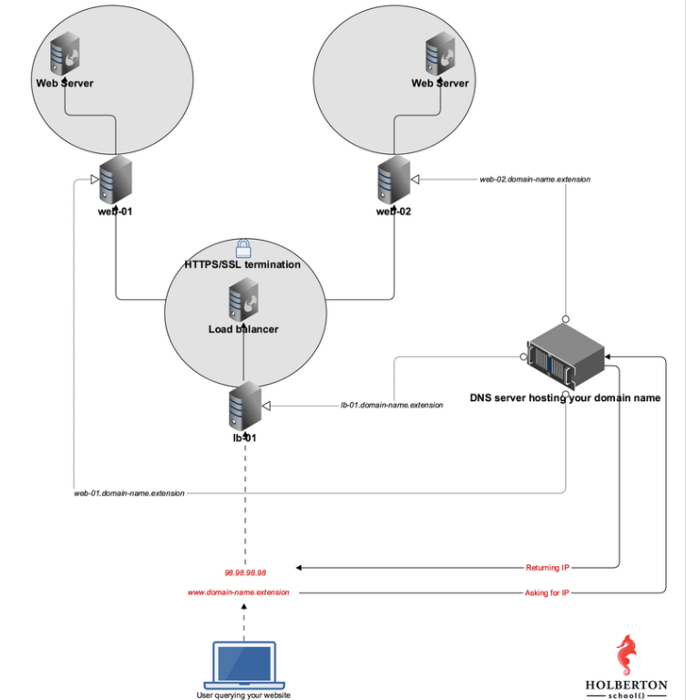

<h1>HTTPS SSL</h1>

In this project i learnt about how HTTPS and SSL work. I configured the servers from a previous project with an SSL certirficate from `certbot` SSL certificate provider and implemented HAproxy SSL termination for inbound and outbound connections/communication.

---

<h2>My HA-Setup</h2>

